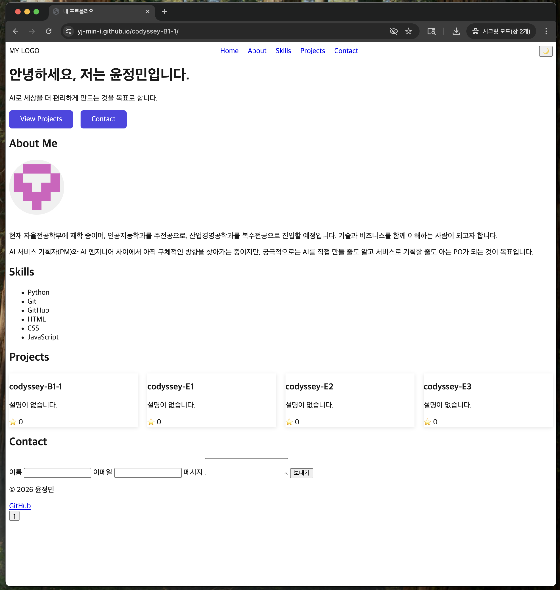
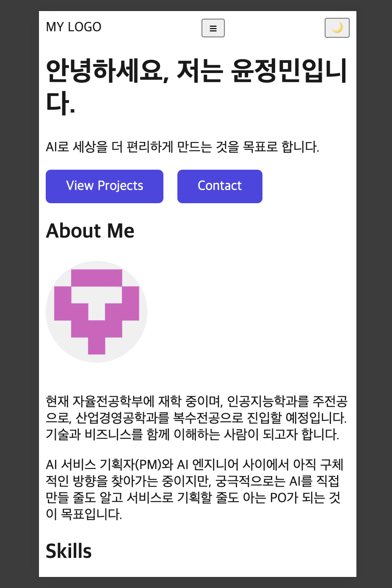
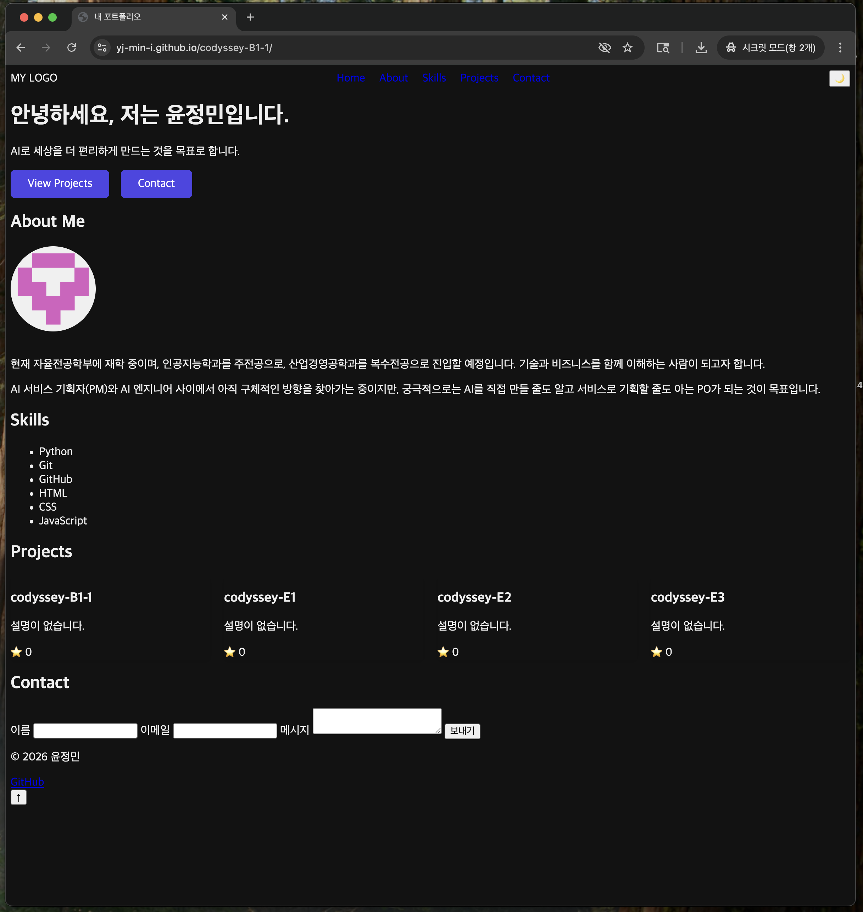

# 나를 소개하는 웹페이지 처음부터 만들기

> 윤정민의 반응형 포트폴리오 웹사이트입니다. 외부 라이브러리 없이 순수 HTML/CSS/JavaScript로 처음부터 끝까지 제작했습니다.

---

## 1. 프로젝트 소개

React, Vue 같은 프레임워크 없이 순수 HTML/CSS/JavaScript만으로 반응형 포트폴리오 웹사이트를 처음부터 끝까지 만들어보는 미션입니다. "사용자 이벤트 → 상태 변경 → 화면 업데이트"로 이어지는 웹의 기본 동작 원리를 직접 손으로 구현하며 익히는 것이 목표였고, GitHub API를 연동해 실제 서비스에서 자주 마주치는 로딩/에러/빈 상태 처리까지 경험해보았습니다.

- **배포 URL**: https://yj-min-i.github.io/codyssey-B1-1/
- **GitHub 저장소**: https://github.com/yj-min-i/codyssey-B1-1

---

## 2. 스크린샷

### 데스크톱


### 모바일


### 다크모드


---

## 3. 사용 기술

| 분류 | 기술 |
|---|---|
| 마크업 | HTML5 (시맨틱 태그) |
| 스타일 | CSS3 (Flexbox, Grid, CSS 변수, 미디어 쿼리) |
| 로직 | Vanilla JavaScript (ES6+) |
| 외부 연동 | GitHub REST API |
| 배포 | GitHub Pages |

React, Vue, jQuery, Bootstrap, Tailwind CSS 등 **외부 프레임워크·라이브러리는 사용하지 않았습니다.**

---

## 4. 폴더 구조

```
codyssey-B1-1/
├── index.html
├── css/
│   └── style.css
├── js/
│   └── main.js
├── screenshots/
│   ├── desktop.png
│   ├── mobile.png
│   └── dark-mode.png
└── README.md
```

---

## 5. 주요 기능

### 5.1 반응형 레이아웃
모바일 퍼스트로 작성했으며, 브레이크포인트는 다음과 같습니다.
- 기본(모바일): ~767px
- 태블릿: 768px 이상
- 데스크톱: 1024px 이상

### 5.2 인터랙티브 UI
- **햄버거 메뉴**: 모바일 화면에서 네비게이션이 숨겨지고 햄버거 버튼 클릭 시 메뉴가 열림/닫힘
- **부드러운 스크롤**: 네비게이션 클릭 시 해당 섹션으로 부드럽게 이동
- **스크롤 탑 버튼**: 스크롤이 300px 이상 내려가면 버튼이 나타나고, 클릭 시 페이지 최상단으로 이동
- **네비게이션 스타일 변경**: 스크롤이 60px 이상 내려가면 네비게이션 배경색이 변경됨
- **다크모드 토글**: 클릭 시 테마 전환, `localStorage`에 저장되어 새로고침해도 유지됨
- **스크롤 애니메이션**: Intersection Observer(threshold 0.2)를 이용해 섹션이 화면에 들어올 때 페이드인 효과 적용

### 5.3 GitHub API 연동
- GitHub REST API(`https://api.github.com/users/yj-min-i/repos`)에서 저장소 목록을 가져와 Projects 섹션에 카드 형태로 렌더링합니다.
- 아래 4가지 상태를 모두 UI로 표현합니다.
  - **로딩 상태**: 데이터 요청 중 "로딩 중..." 표시
  - **성공 상태**: 저장소 카드 리스트 렌더링
  - **에러 상태**: "프로젝트를 불러올 수 없습니다" 메시지 + 재시도 버튼
  - **빈 상태**: "표시할 프로젝트가 없습니다" 메시지
- `fetch` + `async/await` + `try/catch`로 비동기 처리 및 에러 핸들링을 구현했습니다.
- GitHub API는 인증 없이 호출 시 시간당 60회 제한(Rate Limit)이 있으며, 제한 초과(403) 시에도 위의 에러 상태 UI가 그대로 표시되도록 처리했습니다.

### 5.4 폼 유효성 검사 (Contact)
- 이름/이메일/메시지 필수값 검증 (빈 필드 제출 불가)
- 이메일 형식 정규식 검증 (필수값 검증과 형식 검증을 분리해, 빈 칸일 때도 정확한 안내 메시지가 뜨도록 처리)
- 에러 메시지가 각 입력 필드 근처에 표시됨
- `event.preventDefault()`로 기본 제출 동작을 막고, 통과 시 성공 메시지 표시

---

## 6. "상태 → 렌더링" 흐름

이 프로젝트에서 "사용자 이벤트 → 상태 변경 → 화면 업데이트" 흐름이 명확하게 드러나는 부분은 다음과 같습니다.

1. **다크모드 토글**: 버튼 클릭 → `currentTheme` 상태 변경 → `renderTheme()`가 `data-theme` 속성과 CSS 변수를 갱신하며 전체 화면 스타일 변경 → `localStorage`에 상태 저장
2. **GitHub API 연동**: 페이지 로드 → `loading → success/error/empty` 상태 변경 → Projects 섹션 렌더링 결과가 상태에 따라 달라짐
3. **폼 유효성 검사**: 제출 버튼 클릭 → 유효성 검사 결과(상태) 계산 → 에러 메시지 표시/숨김, 성공 메시지 표시
4. **모바일 메뉴 토글**: 햄버거 버튼 클릭 → `active` 클래스 상태 변경 → 네비게이션 메뉴 표시/숨김

---

## 7. 설정 가능한 임계값

| 항목 | 값 | 위치 |
|---|---|---|
| 스크롤 탑 버튼 표시 기준 | 300px | `js/main.js` `SCROLL_TOP_THRESHOLD` |
| 네비게이션 스타일 변경 기준 | 60px | `js/main.js` `NAV_STYLE_THRESHOLD` |
| Intersection Observer threshold | 0.2 | `js/main.js` `IntersectionObserver` 옵션 |

---

## 8. 로컬 실행 방법

```bash
git clone https://github.com/yj-min-i/codyssey-B1-1.git
cd codyssey-B1-1
```

VS Code에서 열고, `index.html`을 우클릭 → **"Open with Live Server"** 로 실행합니다. 별도 빌드/설치 과정 없이 바로 동작합니다.

---

## 9. 배포 방법

```bash
git add .
git commit -m "커밋 메시지"
git push origin main
```

GitHub 저장소 → **Settings → Pages** → Branch를 `main`으로 지정하면 자동으로 배포되며, 아래 URL에서 확인할 수 있습니다.

```
https://yj-min-i.github.io/codyssey-B1-1/
```

---

## 10. 코드 스타일 및 제약 준수 사항

- `var` 대신 `const`/`let`만 사용
- HTML `onclick` 속성 대신 `addEventListener`로 이벤트 연결
- 인라인 `style="..."` 미사용 (모든 스타일은 `css/style.css`에서 관리)
- 최신 Chrome 브라우저에서 정상 동작 확인 완료

---

## 11. 배운 점 / 회고

DOM을 직접 선택하고(`querySelector`), 이벤트를 연결하고(`addEventListener`), 상태가 바뀔 때마다 화면을 다시 그리는 과정을 손으로 짜보면서, React 같은 프레임워크가 내부적으로 무엇을 자동화해주는 기술인지 조금 더 감이 잡혔습니다. 특히 GitHub API 연동에서 로딩/성공/에러/빈 상태를 각각 다른 함수로 나눠 처리하면서, 비동기 데이터를 다루는 화면은 "성공했을 때"만 생각해서는 안 되고 실패 상황까지 미리 설계해야 한다는 점을 체감했습니다.

---

## 12. 보너스 과제

이번 제출에서는 기본 요구사항 구현에 집중하기 위해 보너스 과제는 진행하지 않았습니다.

---

## 13. 설계 노트 및 보완 사항

과제 완성 후 자체적으로 점검하면서 확인한 설계 의도와, 시간 관계상 이번 제출에는 포함하지 않은 개선 여지를 정리합니다.

### 13.1 레이아웃 기술 선택 근거
- **네비게이션 — Flexbox**: 로고, 메뉴, 다크모드 버튼을 한 줄에서 양 끝/사이로 정렬해야 해서 `justify-content: space-between`을 쓰는 Flexbox가 적합했습니다.
- **Projects 카드 — Grid**: 카드 개수가 API 응답에 따라 가변적이고, 화면 너비에 따라 한 줄에 들어가는 카드 수가 자동으로 바뀌어야 해서 `repeat(auto-fit, minmax(250px, 1fr))`를 쓰는 Grid를 선택했습니다. Flexbox의 `flex-wrap`으로도 비슷하게 구현할 수 있지만, 열 너비를 최소/최대값으로 동시에 제어하기에는 Grid의 `minmax()`가 더 직관적이었습니다.

### 13.2 상태 관리 방식
현재 `currentTheme`처럼 기능별로 개별 상태 변수를 두는 방식을 사용했습니다. 하나의 `STATE` 객체로 모든 상태(테마, 프로젝트 목록, 폼 유효성 등)를 통합 관리하는 방식도 고려했지만, 이번 프로젝트는 상태 간 의존성이 없는 독립적인 기능 3~4개로 구성되어 있어 개별 변수로도 "이벤트 → 상태 변경 → 렌더링" 흐름이 코드상 충분히 명확하다고 판단해 개별 관리 방식을 유지했습니다. 기능이 늘어나 상태 간 연동이 필요해지는 시점에는 중앙 STATE 객체로 리팩토링하는 것이 더 적절할 것으로 예상합니다.

### 13.3 접근성(Accessibility) 관련
- 햄버거 버튼에 `aria-label="메뉴 열기"`를 기본 적용했고, 메뉴 열림/닫힘 상태를 `aria-expanded` 속성으로 함께 갱신하도록 했습니다.
- 폼 에러 메시지 영역에는 현재 `aria-live` 속성을 적용하지 않았습니다. 스크린리더 사용자에게 실시간으로 에러를 읽어주려면 `aria-live="polite"`를 에러 메시지 컨테이너에 추가하는 것이 다음 개선 과제입니다.

### 13.4 타이포그래피
`:root`에 색상·간격 변수는 정의했지만 글꼴 관련 변수(`--font-base`, `--font-size-*` 등)는 별도로 분리하지 않았습니다. 프로젝트 규모가 작아 지금은 브라우저 기본 글꼴을 그대로 사용했고, 추후 커스텀 폰트를 적용할 경우 CSS 변수로 분리할 계획입니다.

### 13.5 다크모드 초기값
현재는 `localStorage`에 저장된 값이 없으면 기본값을 `light`로 고정하고 있습니다. `window.matchMedia('(prefers-color-scheme: dark)')`로 사용자의 OS 다크모드 설정을 초기값에 반영하는 것도 고려했으나, `localStorage` 저장값과의 우선순위 로직이 추가로 필요해 이번 범위에서는 제외했습니다.

### 13.6 에러 처리 상세도
GitHub API 호출 실패 시 사용자에게는 "프로젝트를 불러올 수 없습니다" 메시지만 보여주고, `catch` 블록에서 별도의 에러 로깅은 하지 않았습니다. 실제 서비스라면 `console.error(error)`로 콘솔에 상세 원인을 남기거나, 상태 코드(403 등)에 따라 사용자 메시지를 다르게 보여주는 방식이 더 친절할 것입니다.